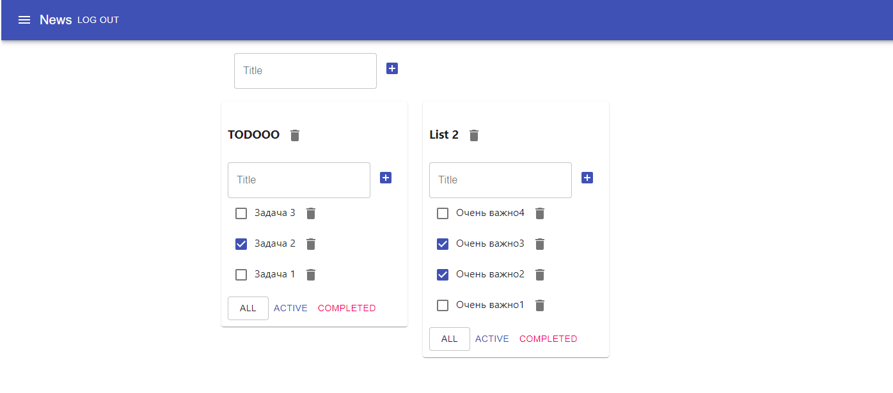

## Projects Title:

Todolist

## About The Project:

Todolist is a popular task manager and to–do list application. In this application you can create and delete todo-lists,
change their name, create, delete, modify and sort tasks in them. Registration is also implemented in the project. In
this application,I also used a storybook, that allows me to develop components in isolation, which improves testability
and speed of development. I have also additionally written unit tests.

DEMO: https://gorelovap.github.io/ToDo/#/

## Built With:

- React
- Redux Toolkit
- TypeScript
- Material UI
- Formik
- Yup
- Storybook
- Unit testing

## Usage:
You must sign up here ( https://social-network.samuraijs.com ) or log in with a test account.

## Contact:

GorelovaP

- LinkedIn: https://www.linkedin.com/in/polin%D0%B0-gorelova/
- GitHub: https://github.com/GorelovaP
- Email: gorelic2000p@gmail.com

## License:

MIT License

Copyright (c) [year] [fullname]

Permission is hereby granted, free of charge, to any person obtaining a copy of this software and associated
documentation files (the "Software"), to deal in the Software without restriction, including without limitation the
rights to use, copy, modify, merge, publish, distribute, sublicense, and/or sell copies of the Software, and to permit
persons to whom the Software is furnished to do so, subject to the following conditions:

The above copyright notice and this permission notice shall be included in all copies or substantial portions of the
Software.

THE SOFTWARE IS PROVIDED "AS IS", WITHOUT WARRANTY OF ANY KIND, EXPRESS OR IMPLIED, INCLUDING BUT NOT LIMITED TO THE
WARRANTIES OF MERCHANTABILITY, FITNESS FOR A PARTICULAR PURPOSE AND NONINFRINGEMENT. IN NO EVENT SHALL THE AUTHORS OR
COPYRIGHT HOLDERS BE LIABLE FOR ANY CLAIM, DAMAGES OR OTHER LIABILITY, WHETHER IN AN ACTION OF CONTRACT, TORT OR
OTHERWISE, ARISING FROM, OUT OF OR IN CONNECTION WITH THE SOFTWARE OR THE USE OR OTHER DEALINGS IN THE SOFTWARE.

